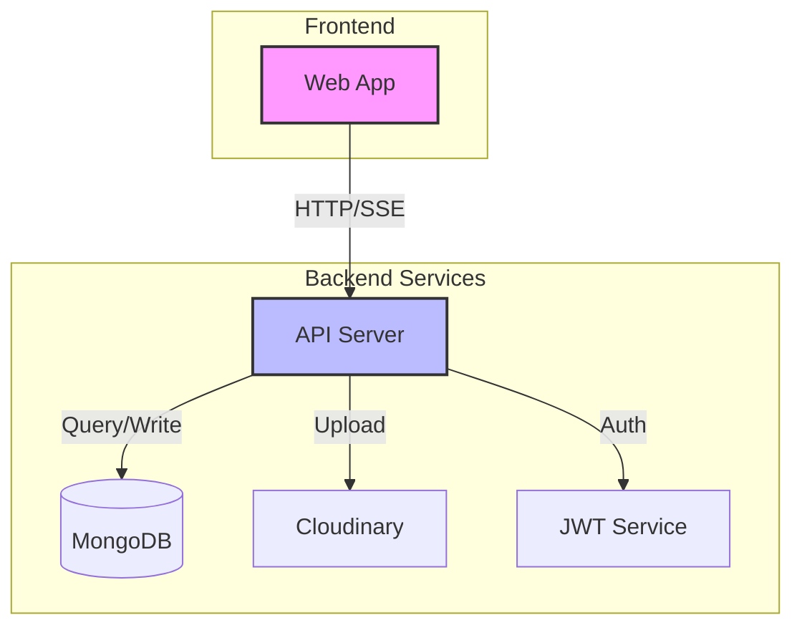

# Thanh Lý Đồ Cũ

> Nền tảng mua bán đồ cũ uy tín, an toàn và tiện lợi

## 📖 Giới Thiệu

**Thanh Lý Đồ Cũ** là website kết nối người mua và người bán đồ cũ, với hệ thống xác thực và đánh giá uy tín. Website được xây dựng với các công nghệ hiện đại, đảm bảo trải nghiệm người dùng tốt nhất.


> Platform kết nối mua bán đồ cũ đáng tin cậy

## 💡 Giới Thiệu

**Thanh Lý Đồ Cũ** là dự án được tạo ra với mong muốn xây dựng một cộng đồng mua bán đồ cũ văn minh và đáng tin cậy. Chúng tôi hiểu rằng việc mua bán đồ cũ có thể gặp nhiều rủi ro, vì vậy nền tảng của chúng tôi được thiết kế để đảm bảo:

- 🛡️ **An toàn tối đa** cho người mua và người bán
- � **Tương tác trực tiếp** giữa các bên liên quan
- ⭐ **Đánh giá uy tín** sau mỗi giao dịch
- 📢 **Minh bạch thông tin** về sản phẩm

### ✨ Tính Năng Nổi Bật

- **Dành Cho Người Bán**

  - Đăng tin với nhiều hình ảnh chất lượng cao
  - Quản lý đơn hàng dễ dàng
  - Chat trực tiếp với người mua
  - Xây dựng hồ sơ uy tín

- **Dành Cho Người Mua**

  - Tìm kiếm thông minh theo nhiều tiêu chí
  - Lọc sản phẩm theo danh mục, giá
  - Chat và thỏa thuận với người bán
  - Đánh giá sau khi mua hàng

- **Hệ Thống Quản Trị**
  - Kiểm duyệt nội dung bài đăng
  - Xử lý báo cáo vi phạm
  - Thống kê chi tiết
  - Quản lý người dùng

### Ảnh chụp màn hình


_Trang chủ với danh sách sản phẩm mới nhất_


_Trang chi tiết sản phẩm với thông tin người bán_


_Dashboard quản lý dành cho admin_

## 2. Kiến Trúc & Tech Stack

### Sơ đồ tổng thể

## 🛠 Công Nghệ Sử Dụng

### Kiến Trúc Tổng Thể



### 🎨 Frontend

Chúng tôi sử dụng các công nghệ hiện đại nhất để xây dựng giao diện người dùng:

- **React 18**: Tối ưu hiệu năng với Concurrent Mode
- **TypeScript**: Đảm bảo type-safety, giảm thiểu lỗi
- **Bootstrap 5**: UI responsive, thân thiện mobile
- **SCSS**: Styling linh hoạt, dễ bảo trì
- **Vite**: Build tool siêu nhanh
- **Context API**: Quản lý state gọn gàng

### ⚡ Backend

Backend được xây dựng với những công nghệ mạnh mẽ:

- **Node.js & Express**: REST API hiệu năng cao
- **TypeScript**: Type-safe development
- **MongoDB & Mongoose**: Database linh hoạt
- **JWT**: Xác thực bảo mật
- **OpenAPI/Swagger**: API documentation
- **Jest**: Automated testing

### 🌟 Điểm Nổi Bật

- **Type Safety**: TypeScript giúp phát hiện lỗi sớm
- **Real-time**: SSE cho thông báo 即時
- **Scalable**: Kiến trúc module hóa, dễ mở rộng
- **Mobile-first**: Responsive trên mọi thiết bị
- **Developer Experience**: Hot reload, debug tools

## 🚀 Hướng Dẫn Cài Đặt

### 📋 Yêu Cầu Hệ Thống

Trước khi bắt đầu, hãy đảm bảo máy tính của bạn đã cài đặt:

- **Node.js**: v16.0.0 trở lên
- **MongoDB**: v6.0 trở lên
- **Git**: Bất kỳ phiên bản nào
- **NPM/Yarn**: Phiên bản mới nhất

### 🔧 Các Bước Cài Đặt

1. **Clone Project**

```bash
# Clone repository
git clone https://github.com/Ji-Eung/cvinh-doanchuyennganh.git

# Di chuyển vào thư mục project
cd cvinh-doanchuyennganh
```

2. **Cài Đặt Dependencies**

```bash
# Backend dependencies
cd server
npm install

# Frontend dependencies
cd ../client
npm install
```

3. **Cấu Hình Môi Trường**

```bash
# Backend environment
cd server
cp .env.example .env
# Mở file .env và cập nhật các biến môi trường

# Frontend environment
cd ../client
cp .env.example .env
# Cập nhật VITE_API_URL trong .env
```

4. **Khởi Tạo Database**

```bash
# Trong thư mục server
npm run seed
# Lệnh này sẽ tạo admin account và dữ liệu mẫu
```

5. **Chạy Development Server**

```bash
# Terminal 1 - Backend
cd server
npm run dev

# Terminal 2 - Frontend
cd client
npm run dev
```

### 🐳 Chạy với Docker

Nếu bạn quen thuộc với Docker, có thể sử dụng Docker Compose:

```bash
# Build và chạy các containers
docker compose up -d

# Kiểm tra logs
docker logs -f oldmarket-api
docker logs -f oldmarket-client

# Dừng services
docker compose down
```

npm run seed
npm run dev
\`\`\`

3. Setup frontend:
   \`\`\`bash
   cd client
   cp .env.example .env
   npm install
   npm run dev
   \`\`\`

### Biến Môi Trường

**Backend (.env):**
\`\`\`
MONGODB_URI=mongodb://localhost:27017/oldmarket
JWT_ACCESS_SECRET=dev_access
JWT_REFRESH_SECRET=dev_refresh
PORT=8080
CORS_ORIGINS=http://localhost:5173
ADMIN_EMAIL=admin@example.com
ADMIN_PASSWORD=admin123
\`\`\`

**Frontend (.env):**
\`\`\`
VITE_API_URL=http://localhost:8080/api
\`\`\`

### Docker

\`\`\`bash
docker compose up -d
\`\`\`

### Seeding Data

\`\`\`bash
cd server
npm run seed # Tạo categories + admin account
\`\`\`

## 4. Demo Access

### Local Demo Accounts

- **Admin:** admin@example.com / admin123
- **User:** user@example.com / user123

### Links

- Frontend: http://localhost:5173
- API: http://localhost:8080
- API Docs: http://localhost:8080/openapi.yaml
- Admin Dashboard: http://localhost:5173/admin

## 5. Cấu Trúc Project

\`\`\`
├── client/ # Frontend React app
│ ├── src/
│ │ ├── components/ # React components
│ │ ├── pages/ # Page components  
│ │ ├── api/ # API client
│ │ └── utils/ # Helper functions
│ └── public/ # Static assets
├── server/ # Backend Express app
│ ├── src/
│ │ ├── config/ # App configuration
│ │ ├── models/ # MongoDB models
│ │ ├── routes/ # API routes
│ │ ├── middleware/ # Express middleware
│ │ └── utils/ # Helper functions
│ └── tests/ # Test suites
├── docs/ # Documentation
└── docker-compose.yml # Docker compose config
\`\`\`

### Coding Style

- ESLint + Prettier config
- Airbnb JavaScript Style Guide
- Conventional Commits

### Git Workflow

- Branch naming: feature/_, bugfix/_, hotfix/\*
- PR template với checklist
- Squash & merge vào main

## 6. Use Cases Demo

### User Flow

1. Đăng ký tài khoản mới

   - UI: /signup
   - API: POST /api/auth/register

2. Đăng bài bán

   - UI: /posts/new
   - API: POST /api/posts

3. Chat với người bán

   - UI: /chat/:userId
   - API: GET /api/chat/with/:userId

4. Đánh giá sau giao dịch
   - UI: /transactions/:id
   - API: POST /api/ratings

### Admin Flow

1. Duyệt bài đăng

   - UI: /admin/posts
   - API: PATCH /api/admin/posts/:id/approve

2. Xem báo cáo vi phạm
   - UI: /admin/reports
   - API: GET /api/admin/reports

## API Documentation

- OpenAPI Spec: [openapi.yaml](/openapi.yaml)
- Swagger UI: http://localhost:8080/api-docs

## Database Schema

### ERD


### Main Collections

- users
- posts
- transactions
- messages
- ratings
- reports
- categories

### Migration Scripts

\`\`\`bash
cd server/scripts
node migrate-db.js # Run migrations
\`\`\`

## License

Academic / Educational use only. See [LICENSE](LICENSE) file.
